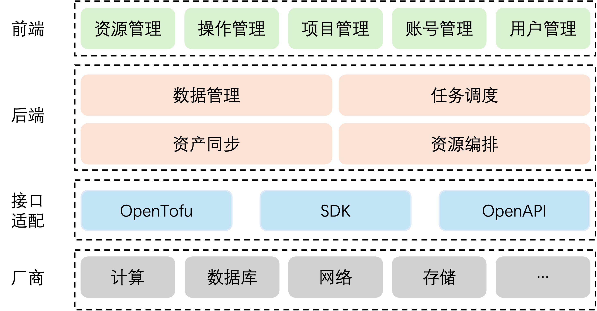
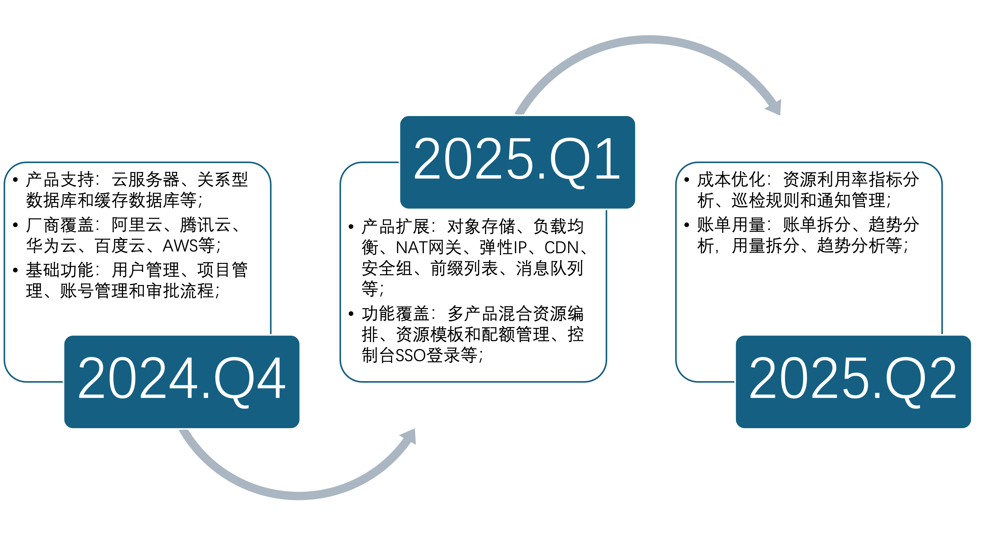

# 项目介绍
## 概述

HCP是B站内部针对多云场景下的进行资源管理、自动化交付、运维以及资源运营的CMP平台的开源版本，支持了主流的云厂商和云产品，包括IaaS和PaaS类的云产品。旨在和社区的同学一起共建多云场景下的统一CMP能力，帮助内部业务高效使用云资源，尽可能屏蔽底层不同厂商的差异，降低使用成本。

HCP支持如下能力：

- 国内外主流厂商以及账号的接入和管理
- 主要云产品的资源管理和自动化操作，比如：新购、改配、清退等
- 用户管理
- 项目管理
## 项目架构


# 安装部署
## 环境准备
**语言：推荐使用**Go 1.22.5或更高版本

**框架：推荐使用**Kratos 1.1.36或更高版本

**容器：** Docker

**数据库：** Mysql

**Web服务器：** Nginx
## 源码下载

```python
1.配置包代理镜像
go env -w GOPROXY=https://mirrors.aliyun.com/goproxy/,direct
2.检查和更新项目的依赖项
go mod tidy
3.构建go编译包
进入 app/interface/v1/cmd
运行 go build -o hcp命令
运行 ./hcp即可启动项目
```

## 安装&&编译


### 依赖环境
`Docker、MySQL`

```python
MySQL:根目录会有database/hcp.sql文件请安装好MySQL并创建好数据库后，导入hcp.sql文件
```

### 编译安装

#### `Nginx`编译

```python
1.将下载的项目部署到主机中
2.根目录下会有dockerfile_fronten文件，运行以下命令来构建Nginx镜像：
docker build  -t hcp_forentend:v1.0  -f ./dockerfile_frontend .
3.运行构建的Nginx镜像
docker run -p 80:80 -d hcp_forentend:v1.0
```

#### `HCP`编译

```python
1.根目录下会有dockerfile_base文件，运行以下命令来构建基础镜像
docker build  -t hcp-bash:v1.0  -f ./dockerfile_base .
2.根目录下会有dockerfile文件，运行以下命令来构建HCP镜像
docker build ./ -t hcp:v1.0
3.运行构建的hcp镜像
docker run -p 8001:8001 -d hpc:v1.0
```

# 使用说明
使用说明参考[tutorial.md](docs/tutorial.md)

# Roadmap


# 如何贡献
HCP仓欢迎广大开发者体验并参与贡献，在参与社区贡献前

针对HCP仓，开发者准备本地代码与提交PR时需要重点关注如下几点：

1. 提交PR时，请按照PR模板仔细填写本次PR的业务背景、目的、方案等信息。
2. 若您的修改不是简单的bug修复，而是涉及到新增特性、新增接口、新增配置参数或者修改代码流程等，请务必先通过Issue进行方案讨论，以避免您的代码被拒绝合入。若您不确定本次修改是否可被归为“简单的bug修复”，亦可通过提交Issue进行方案讨论。

代码下载与贡献流程

1. 进行代码开发前，请先将需要参与开发的仓库fork到个人仓，然后将个人仓下载到本地。并在本地分支进行代码修改。
2. 参考每个开放项目的说明文档，进行本地构建与验证。
3. 代码验证满足贡献要求后，提交Pull-Request，将代码贡献到相应的开放项目。
4. 请注意查看门禁测试结果，若未通过，请根据问题提示进行本地代码修改；若通过，此PR会被分配给commiter检视，请关注commiter的检视意见。
5. 当您的PR检视通过后，代码会合入相应的开放项目

# 联系我们
任何问题可以发送邮件给我们：hcp@bilibili.com

# 开源协议
本项目遵循[Apache License, Version 2.0](https://github.com/bilibili/HCP/blob/main/LICENSE)开源协议。

