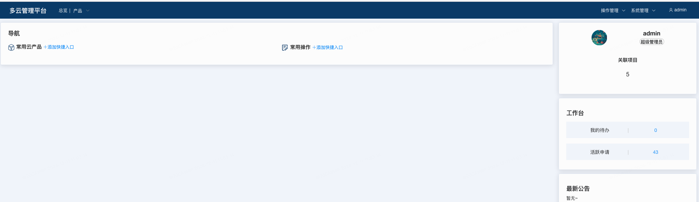
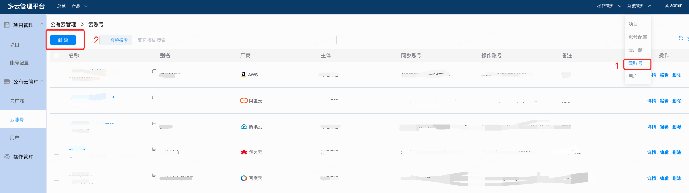
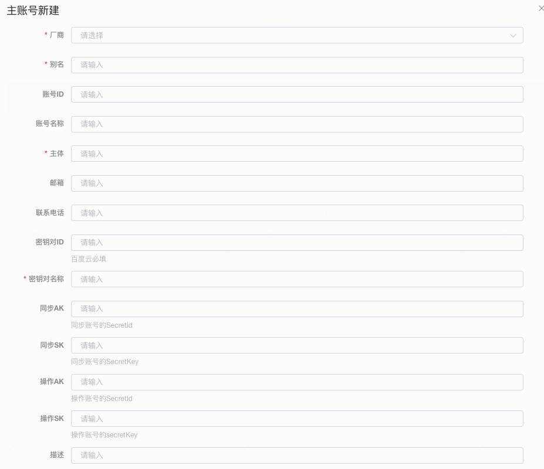
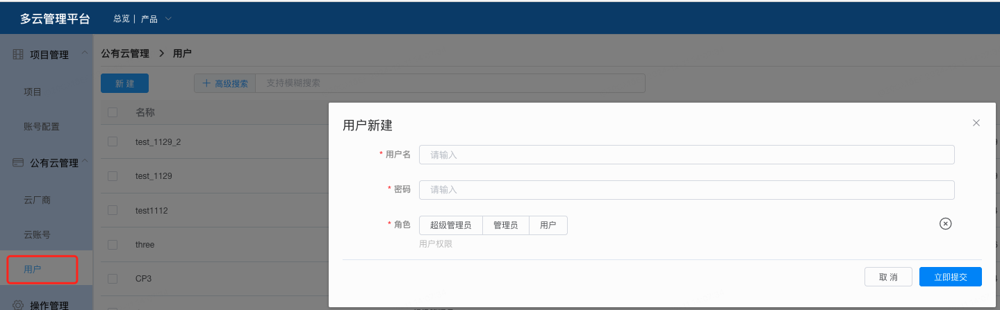
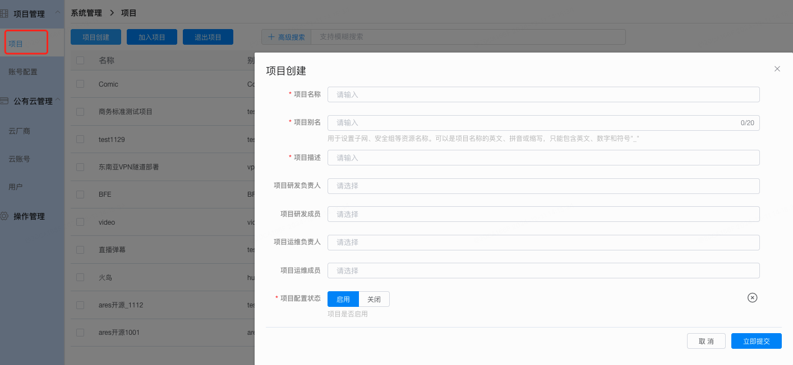
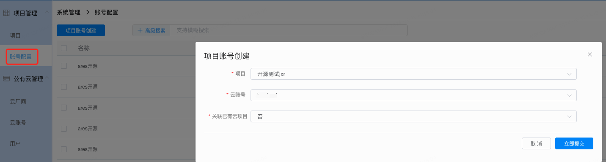
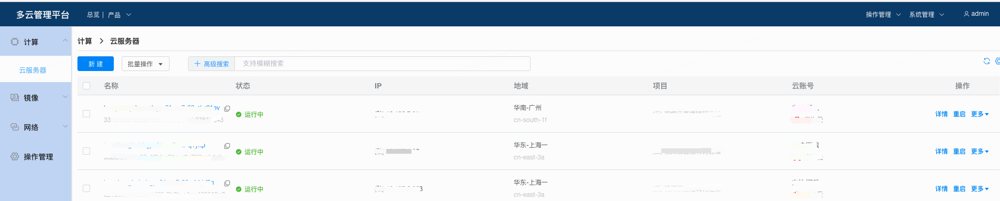
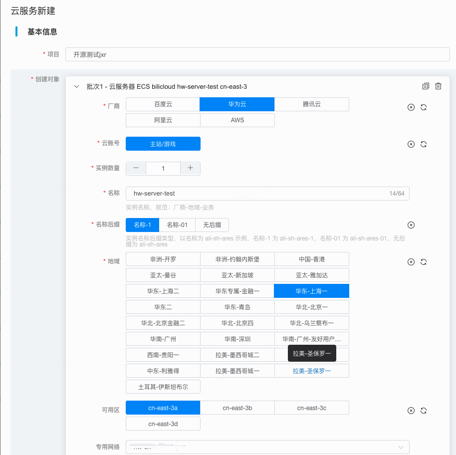

# HCP入门文档
## 初始化
#### 登录


#### 初始账户和密码：

```python
admin

1234
```

#### 进入主页，添加云产品和常用操作的快捷入口




#### 配置厂商账号



#### 配置普通用户，并且授权


## 使用
### 以云服务器为例
## 配置项目
#### 首先需要配置资源归属的项目，用于后续的资源管理和权限隔离，该项目和云上标签以及资源组相对应



#### 给项目关联云账号


#### 如果之前云账号中已经存在云服务器，那么再配置好云账号后，系统会自动同步账号下的资源到HCP平台中，如下：



#### 购买云服务器

